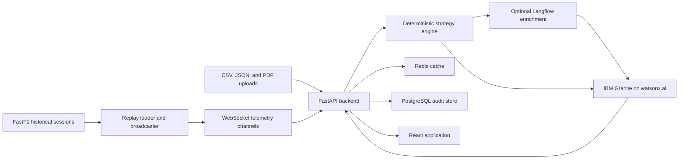

# PitMind

PitMind is an AI-assisted race strategy and telemetry platform for motorsport
teams, drivers, engineers, and fans. It combines historical Formula 1 session
replay, real-time WebSocket telemetry, explainable strategy scoring, IBM
Granite narration, post-race debrief analysis, and role-specific dashboards in
one application.

The repository is intentionally structured as a single deployable product:

- `backend/` contains the FastAPI API, strategy engine, AI integrations,
  persistence services, and the integrated historical replay utility.
- `frontend/` contains the React and TypeScript application.
- `scripts/` contains local and cloud deployment helpers.
- `replay-data-examples/` contains example replay payloads.
- `examples/driver-telemetry-trace/` contains a WebSocket telemetry subscriber.

## The Racing Problem

Race strategy decisions are made under time pressure. Teams must interpret tyre
degradation, pace loss, traffic gaps, weather, safety-car risk, and pit-window
timing while the race state is continuously changing. The raw data is valuable,
but it can be difficult to convert into a clear, auditable recommendation fast
enough to influence a decision.

Fans face a related problem: the decisive strategic story is often hidden
behind timing screens and commentary shorthand. A pit stop may look arbitrary
unless the viewer can see the evidence, alternatives, and confidence behind
the call.

PitMind addresses both needs:

- Engineers receive structured telemetry analysis, strategy scores, evidence,
  assumptions, and an auditable explanation.
- Strategists can compare scenarios and commit decisions to an audit log.
- Fans receive accessible race context and commentary-oriented views.
- Developers can replay historical sessions as realistic live feeds without
  waiting for a live race weekend.

## Technical Execution

### IBM AI Integration

PitMind uses IBM Granite through watsonx.ai as an explanation layer on top of a
deterministic strategy engine. The model is not asked to invent the numerical
strategy calculation. Instead, the backend computes the race recommendation
first and supplies Granite with structured context:

1. Telemetry is validated and normalized.
2. The heuristic strategy engine calculates pit urgency, safety-car
   probability, overtake risk, and a recommended pit window.
3. Optional Langflow orchestration enriches the context with external signals.
4. Granite generates a concise explanation with evidence, assumptions,
   confidence, and an alternative action.
5. The backend returns both the deterministic scores and the AI explanation.

This hybrid pattern is important for high-pressure decision support. It keeps
the recommendation traceable while using generative AI where it adds the most
value: communication, summarization, contextual reasoning, and accessibility.

Post-race analysis uses Docling-compatible document processing to extract
structured content from uploaded reports before generating a concise technical
debrief. This makes the same platform useful during a race and after the
chequered flag.

### Open-Source Technology

PitMind combines IBM services with open-source components:

| Layer | Technology | Purpose |
| --- | --- | --- |
| Frontend | React, TypeScript, Vite | Engineer, strategist, and fan interfaces |
| Backend | FastAPI, Pydantic, Uvicorn | Async APIs, validation, and streaming |
| Historical data | FastF1, pandas, NumPy | Session loading and telemetry processing |
| Replay | WebSockets | Historical session broadcast as a live-style feed |
| AI explanation | IBM Granite on watsonx.ai | Explainable race strategy narration |
| Workflow orchestration | Langflow, optional | Visual enrichment pipeline |
| Document processing | Docling | Post-race report extraction |
| Persistence | PostgreSQL, SQLAlchemy, Alembic | Audit logs and durable state |
| Cache | Redis | Strategy caching and session coordination |
| Authentication | Firebase, optional for local use | User identity and race-state sync |
| Deployment | Docker Compose, Nginx | Portable local and production deployment |

### Integrated Historical Replay

The historical replay utility is bundled in `backend/open_pit_wall/`. It can:

- Download recorded sessions through FastF1.
- Cache normalized replay files as JSON.
- Broadcast telemetry at 10 Hz.
- Replay leaderboard, weather, lap, and race-control events.
- Provide play, pause, seek, restart, loop, and speed controls.
- Publish full-field telemetry or driver-specific channels.

The API exposes replay discovery at:

```text
GET /api/v1/replay/sessions
```

Replay WebSocket clients can subscribe to:

| Channel | Description |
| --- | --- |
| `telemetry.drivers` | Full-field telemetry frames |
| `telemetry.drivers.{DRIVER_CODE}` | Telemetry for one driver |
| `leaderboard` | Derived race order and gaps |
| `telemetry.weather` | Weather snapshots |
| `telemetry.lap` | Current lap and replay elapsed time |
| `race_control` | Track status and race-control messages |

## Innovation

PitMind is not only a telemetry dashboard and not only an AI chat interface.
Its distinctive value is the connection between replayable race evidence,
deterministic strategy scoring, and explainable AI narration.

Key ideas:

- **Inspectable AI:** Every recommendation includes scores, reasons,
  assumptions, alternatives, and confidence decomposition.
- **Historical sessions as live simulations:** Teams and developers can test
  race workflows against recorded sessions through the same streaming model
  used for live-style operation.
- **Dual audience design:** Engineer views preserve technical detail while fan
  views translate the same race state into understandable context.
- **Auditable decisions:** Strategy calls can be persisted with execution
  checklists and telemetry snapshots.
- **Graceful degradation:** Redis, PostgreSQL, Langflow, and external AI
  services are integrated so the application can retain useful local behavior
  when optional infrastructure is unavailable.

## Challenge Fit

PitMind directly addresses a real racing challenge: turning dense telemetry
into a timely, explainable decision.

For teams, it reduces the cognitive load involved in evaluating pit windows,
tyre degradation, traffic risk, and changing race conditions. For drivers, it
improves the clarity of the reasoning that supports radio instructions. For
fans, it makes strategy easier to follow and turns hidden race dynamics into
an understandable narrative.

The historical replay engine also makes the project practical in a challenge
environment. A complete race weekend is not required to demonstrate the
solution. Recorded telemetry can be replayed as a realistic streaming feed,
allowing repeatable demos, testing, and strategy experiments.

## Implementation And Feasibility

The system is designed to grow beyond a prototype:

- FastAPI provides an async foundation for REST and WebSocket workloads.
- Redis supports cache-backed coordination and can be replaced by a managed
  service in production.
- PostgreSQL stores audit history and strategy commitments.
- Docker Compose provides a repeatable local environment.
- Nginx proxies browser API and WebSocket traffic through a single origin.
- The replay utility decouples product testing from live data availability.
- Environment templates contain configuration names only. Runtime values are
  supplied by each deployment owner.

The architecture can support future integrations such as live timing feeds,
weather providers, team-specific simulation models, managed observability,
and additional AI workflows without replacing the core application.

## Architecture



## Requirements

### Docker Setup

Recommended:

- Docker Desktop or Docker Engine
- Docker Compose
- At least 8 GB RAM for the backend image build because Docling and CPU-only
  PyTorch are installed

### Local Development

Required:

- Python 3.12+
- Node.js 20+
- npm
- PostgreSQL 16, unless database fallback behavior is sufficient
- Redis 7, unless in-memory fallback behavior is sufficient

## Environment Configuration

Copy the root template:

```bash
cd pitMind
cp .env.example .env
```

The template intentionally leaves deployment-specific values blank. Do not
commit `.env` files.

### Required For IBM Granite Narration

Set these values in `.env`:

```text
WATSONX_URL=
WATSONX_PROJECT_ID=
WATSONX_API_KEY=
WATSONX_MODEL_ID=
```

Create the watsonx.ai project and access credentials in IBM Cloud before
running AI-backed narration. If these values are not configured, the backend
reports the missing AI requirements instead of embedding credentials in code.

### Required For Firebase Authentication

Set these values when Firebase login and realtime database sync are enabled:

```text
FIREBASE_PROJECT_ID=
FIREBASE_DATABASE_URL=
FIREBASE_WEB_API_KEY=
VITE_FIREBASE_API_KEY=
VITE_FIREBASE_AUTH_DOMAIN=
VITE_FIREBASE_DATABASE_URL=
VITE_FIREBASE_PROJECT_ID=
VITE_FIREBASE_STORAGE_BUCKET=
VITE_FIREBASE_MESSAGING_SENDER_ID=
VITE_FIREBASE_APP_ID=
VITE_FIREBASE_WEB_API_KEY=
```

The `VITE_*` entries are browser configuration values. Firebase security rules
and domain restrictions must still be configured in the Firebase and Google
Cloud consoles.

### Required For Production Persistence

Set these values for PostgreSQL and Redis:

```text
POSTGRES_DB=
POSTGRES_USER=
POSTGRES_PASSWORD=
DATABASE_URL=
REDIS_PASSWORD=
REDIS_URL=
```

The development Docker Compose file can use local defaults. Production
deployments should always provide deployment-specific passwords and URLs.

### Optional Integrations

These values are optional:

```text
LANGFLOW_API_URL=
LANGFLOW_FLOW_ID=
LANGFLOW_API_KEY=
HF_API_TOKEN=
HF_MODEL_ID=
REPLICATE_API_TOKEN=
REPLICATE_MODEL_OWNER=
REPLICATE_MODEL_NAME=
GOOGLE_MAPS_API_KEY=
VITE_GOOGLE_MAPS_API_KEY=
VITE_GA_MEASUREMENT_ID=
```

## Run With Docker

Start the main application:

```bash
docker compose up --build
```

Open:

```text
Application: http://localhost:8080
Backend API: http://localhost:8001
API docs:    http://localhost:8001/docs
```

The Nginx frontend proxies `/api` and WebSocket upgrades to the backend, so
browser builds do not need Docker-internal hostnames.

## Run Locally

Backend:

```bash
cd pitMind/backend
python -m venv .venv
.venv/Scripts/activate
pip install -r requirements.txt
python -m uvicorn main:app --host 127.0.0.1 --port 8000 --reload
```

Frontend:

```bash
cd pitMind/frontend
npm install
npm run dev -- --host 127.0.0.1 --port 5173
```

For local frontend development, set:

```text
VITE_API_BASE_URL=http://127.0.0.1:8000
VITE_WS_URL=ws://127.0.0.1:8000/api/v1/stream/telemetry
```

## Historical Replay Workflow

Launch the integrated interactive session loader:

```powershell
cd pitMind
.\scripts\run-replay.ps1
```

Or run the replay CLI directly:

```bash
cd pitMind/backend
python -m open_pit_wall
```

To broadcast an existing replay file:

```bash
python -m open_pit_wall replay \
  --data-file /path/to/replay.json \
  --host 127.0.0.1 \
  --port 8765 \
  --speed 1.0 \
  --autoplay
```

To run the optional Docker replay service, ensure the selected replay JSON file
exists in the shared replay volume and start:

```bash
docker compose --profile replay up --build
```

The standalone replay WebSocket server listens on:

```text
ws://localhost:8765
```

Example subscription:

```json
{
  "action": "subscribe",
  "channels": ["telemetry.drivers", "leaderboard", "race_control"]
}
```

## Testing

Backend:

```bash
cd pitMind/backend
python -m pytest tests -q
```

Frontend:

```bash
cd pitMind/frontend
npm install
npm test
```

## Repository Notes

- Replay files are JSON, not pickle, to avoid unsafe deserialization.
- Generated FastF1 cache and replay data are ignored by Git.
- Real credentials belong in `.env` or a deployment secret manager.
- The integrated replay utility retains its required MIT notice in
  `THIRD_PARTY_NOTICES.md`.
