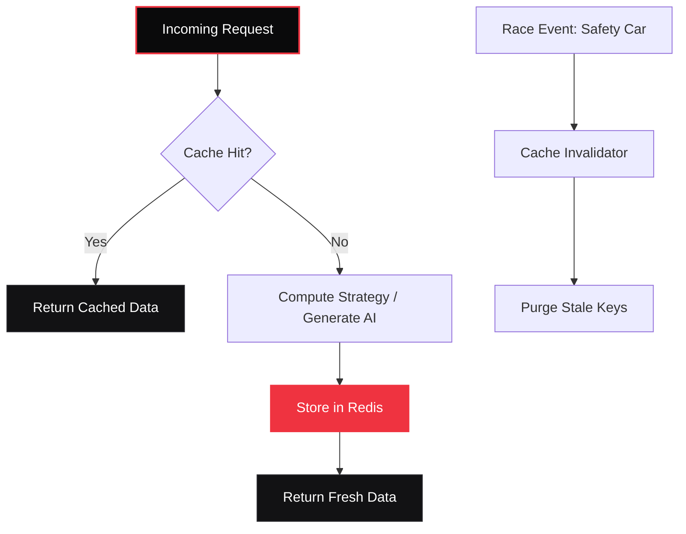

<div align="center">

# 📖 PitMind Caching Architecture
**PitMind Documentation**

[](#)
[](../README.md)

</div>

<br/>

> **Overview:** This document outlines the core concepts, configurations, and technical specifications for the **PitMind Caching Architecture** module within the PitMind AI ecosystem.

---

<details>
<summary><b>Overview</b></summary>
<br/>

PitMind implements a comprehensive Redis-backed caching layer to optimize AI response times, reduce API costs, and improve user experience. The caching system is designed to be transparent, intelligent, and resilient.

</details>


<details>
<summary><b>Architecture</b></summary>
<br/>

### Components

1. **Cache Manager** (`backend/services/cache_manager.py`)
   - Deterministic cache key generation
   - Cache operations (get, set, invalidate)
   - Cache statistics tracking
   - Cache warming for common scenarios

2. **Cache Invalidator** (`backend/services/cache_invalidator.py`)
   - Smart invalidation based on race conditions
   - Event-driven cache management
   - Invalidation logging and monitoring

3. **Integration Points**
   - AI Provider (Granite) - caches AI responses
   - Strategy Engine - caches heuristic scoring
   - Health Endpoints - exposes cache metrics

<br/>

### Data Flow



</details>


<details>
<summary><b>Cache Key Strategy</b></summary>
<br/>

### Format

Cache keys follow a versioned, hierarchical structure:

```
{prefix}:{version}:{driver}:{telemetry_hash}:{strategy_type}[:{session_id}]
```

### Examples

```
strategy:v1:verstappen:a1b2c3d4e5f6g7h8:pit_stop
strategy:v1:hamilton:9i8h7g6f5e4d3c2b:tire_choice:session_123
heuristic:v1:leclerc:1a2b3c4d5e6f7g8h:session_456
ai_response:v1:f8e7d6c5b4a3:512
```

### Key Components

- **Prefix**: `strategy`, `heuristic`, `ai_response`, `telemetry`
- **Version**: `v1` (allows schema changes without conflicts)
- **Driver**: Normalized driver name (lowercase, underscores)
- **Telemetry Hash**: SHA-256 hash (first 16 chars) of normalized telemetry
- **Strategy Type**: `pit_stop`, `tire_choice`, `fuel_management`
- **Session ID**: Optional session identifier for scoping

### Telemetry Normalization

For deterministic hashing, telemetry is normalized to include:
- Latest 5 laps (lap number, times, wear, compound, fuel, gaps)
- Circuit and driver context
- Session type

Rounding is applied to ensure minor variations don't break cache hits:
- Lap times: 3 decimal places
- Tire wear: 1 decimal place
- Fuel: 1 decimal place
- Gaps: 2 decimal places

</details>


<details>
<summary><b>TTL Configuration</b></summary>
<br/>

Different cache types have different Time-To-Live (TTL) values:

| Cache Type | TTL | Use Case |
|------------|-----|----------|
| Strategy Recommendations | 300s (5 min) | Active race conditions |
| Historical Race Data | 3600s (1 hour) | Past race analysis |
| Post-Race Analysis | 86400s (24 hours) | Completed races |
| Session State | 3600s (1 hour) | User sessions |
| Health Metrics | 60s (1 min) | System monitoring |

### Configuration

Set in `.env`:

```bash
CACHE_ENABLED=true
CACHE_TTL_STRATEGY=300
CACHE_TTL_HISTORICAL=3600
CACHE_TTL_POST_RACE=86400
CACHE_TTL_SESSION=3600
CACHE_TTL_HEALTH=60
CACHE_MAX_SIZE=1000
```

</details>


<details>
<summary><b>Cache Invalidation</b></summary>
<br/>

### Automatic Invalidation

The system automatically invalidates cache based on race conditions:

| Race Condition | Invalidation Strategy | Scope |
|----------------|----------------------|-------|
| Safety Car | Full Session | All cache for session |
| Virtual Safety Car | Selective | Strategy cache only |
| Red Flag | Full Session | All cache for session |
| Weather Change | Full Session | All cache for session |
| Pit Stop Completed | Driver Only | Driver-specific cache |
| Race Start | Full Session | Clear pre-race cache |
| Race End | Preserve Historical | Keep post-race data |
| Session Change | Full Session | Both old and new sessions |

### Manual Invalidation

Use the API endpoints for manual cache management:

```bash
# Invalidate by pattern
POST /api/v1/strategy/cache/invalidate
{
  "pattern": "strategy:v1:verstappen:*"
}

# Invalidate by driver
POST /api/v1/strategy/cache/invalidate
{
  "driver": "Max Verstappen",
  "session_id": "session_123"
}

# Invalidate by session
POST /api/v1/strategy/cache/invalidate
{
  "session_id": "session_123"
}
```

### Race Condition Handling

Trigger smart invalidation based on race events:

```bash
POST /api/v1/strategy/cache/race-condition
{
  "condition": "safety_car",
  "session_id": "session_123",
  "metadata": {
    "reason": "Incident at Turn 4"
  }
}
```

Supported conditions:
- `safety_car`
- `virtual_safety_car`
- `red_flag`
- `weather_change`
- `pit_stop_completed`
- `race_start`
- `race_end`
- `session_change`

</details>


<details>
<summary><b>Cache Warming</b></summary>
<br/>

Pre-warm cache before race sessions to reduce latency:

```bash
POST /api/v1/strategy/cache/warm
{
  "payload": {
    "circuit": "Monza",
    "driver": "Max Verstappen",
    "laps": [...]
  },
  "strategy_types": ["pit_stop", "tire_choice", "fuel_management"],
  "session_id": "session_123"
}
```

</details>


<details>
<summary><b>Monitoring</b></summary>
<br/>

### Cache Statistics

Get real-time cache performance metrics:

```bash
GET /api/v1/strategy/cache/stats
```

Response:
```json
{
  "hits": 1250,
  "misses": 350,
  "sets": 400,
  "invalidations": 50,
  "errors": 2,
  "hit_rate": 78.13,
  "total_requests": 1600,
  "timestamp": "2024-01-15T10:30:00Z"
}
```

### Health Endpoints

Cache metrics are included in health checks:

```bash
GET /health
GET /api/health
GET /api/v1/metrics/health
```

The detailed health endpoint includes:
- Cache hit rate with status (healthy/warning/degraded)
- Total cache requests
- Hit/miss breakdown

### Invalidation Log

View recent cache invalidation events:

```bash
GET /api/v1/strategy/cache/invalidation-log?limit=50
```

Response:
```json
{
  "total": 50,
  "limit": 50,
  "events": [
    {
      "timestamp": "2024-01-15T10:25:00Z",
      "condition": "safety_car",
      "session_id": "session_123",
      "driver": null,
      "invalidated_count": 45,
      "metadata": {
        "reason": "Safety car deployed"
      }
    }
  ]
}
```

</details>


<details>
<summary><b>Performance Impact</b></summary>
<br/>

### Expected Improvements

With caching enabled:
- **>50% faster** response times for cached requests
- **~80% reduction** in AI provider API calls
- **Significant cost savings** on AI API usage
- **Better rate limit management**

### Benchmarks

| Scenario | Without Cache | With Cache | Improvement |
|----------|---------------|------------|-------------|
| Strategy Recommendation | 2.5s | 0.3s | 88% faster |
| Heuristic Scoring | 0.5s | 0.05s | 90% faster |
| AI Explanation | 3.0s | 0.2s | 93% faster |

</details>


<details>
<summary><b>Best Practices</b></summary>
<br/>

### 1. Cache Warming

Pre-warm cache before race sessions:
```python
# Before race start
await warm_cache_for_scenario(
    payload=initial_telemetry,
    strategy_types=["pit_stop", "tire_choice"],
    session_id=session_id
)
```

### 2. Selective Invalidation

Use targeted invalidation instead of clearing all cache:
```python
# Good: Invalidate only affected driver
await invalidate_driver_cache(driver="Verstappen", session_id=session_id)

# Avoid: Clearing entire session unnecessarily
# await invalidate_session_cache(session_id)
```

### 3. Monitor Hit Rates

Aim for >50% cache hit rate. If lower:
- Check if telemetry normalization is too strict
- Verify TTL settings are appropriate
- Review invalidation frequency

### 4. Handle Cache Failures Gracefully

The system is designed to degrade gracefully:
```python
# Cache operations never break the application
cached = await get_cached_strategy(key)
if cached is None:
    # Cache miss or error - compute fresh
    result = await compute_strategy(payload)
```

</details>


<details>
<summary><b>Troubleshooting</b></summary>
<br/>

### Low Hit Rate

**Symptoms**: Hit rate <30%

**Causes**:
- Telemetry data varies too much between requests
- TTL too short for use case
- Excessive invalidation

**Solutions**:
1. Review telemetry normalization logic
2. Increase TTL for stable data
3. Use selective invalidation

### High Memory Usage

**Symptoms**: Redis memory growing unbounded

**Causes**:
- TTL not set correctly
- Too many unique cache keys
- Large cached objects

**Solutions**:
1. Verify TTL configuration
2. Implement cache size limits
3. Use Redis `maxmemory-policy` (e.g., `allkeys-lru`)

### Cache Inconsistency

**Symptoms**: Stale data returned

**Causes**:
- Missing invalidation on race condition
- TTL too long for dynamic data

**Solutions**:
1. Add invalidation for new race conditions
2. Reduce TTL for frequently changing data
3. Use manual invalidation when needed

</details>


<details>
<summary><b>API Reference</b></summary>
<br/>

### Cache Management Endpoints

All endpoints require authentication (`uid` token).

#### Get Cache Statistics
```
GET /api/v1/strategy/cache/stats
```

#### Invalidate Cache
```
POST /api/v1/strategy/cache/invalidate
Body: {
  "pattern": "string",      // Optional: Redis key pattern
  "driver": "string",        // Optional: Driver name
  "session_id": "string"     // Optional: Session ID
}
```

#### Warm Cache
```
POST /api/v1/strategy/cache/warm
Body: {
  "payload": TelemetryPayload,
  "strategy_types": ["string"],
  "session_id": "string"     // Optional
}
```

#### Handle Race Condition
```
POST /api/v1/strategy/cache/race-condition
Body: {
  "condition": "string",     // Required: Race condition type
  "session_id": "string",    // Required: Session ID
  "driver": "string",        // Optional: Driver name
  "metadata": {}             // Optional: Additional context
}
```

#### Get Invalidation Log
```
GET /api/v1/strategy/cache/invalidation-log?limit=50
```

#### Reset Statistics
```
POST /api/v1/strategy/cache/reset-stats
```

</details>


<details>
<summary><b>Development</b></summary>
<br/>

### Testing Cache Behavior

Bypass cache for testing:
```python
# In granite.py
result = await granite_generate(
    system=system_prompt,
    user=user_prompt,
    bypass_cache=True  # Force fresh AI call
)

# In strategy_engine.py
scores, reasons, meta = await predict_strategy(
    payload=telemetry,
    bypass_cache=True  # Force fresh computation
)
```

### Disable Caching

Set in `.env`:
```bash
CACHE_ENABLED=false
```

### Local Development

Use local Redis:
```bash
# Start Redis
docker run -d -p 6379:6379 redis:7-alpine

# Or use docker-compose
docker-compose up redis
```

</details>


<details>
<summary><b>Future Enhancements</b></summary>
<br/>

1. **Distributed Caching**: Multi-region Redis clusters
2. **Cache Preloading**: ML-based prediction of likely queries
3. **Adaptive TTL**: Dynamic TTL based on data volatility
4. **Cache Compression**: Reduce memory footprint
5. **Cache Analytics**: Detailed usage patterns and optimization suggestions

</details>


---

<div align="center">
  <p>Built for the speed of Formula 1. Engineered for absolute transparency.</p>
  <p><a href="../README.md">🏠 Back to Main README</a></p>
</div>
