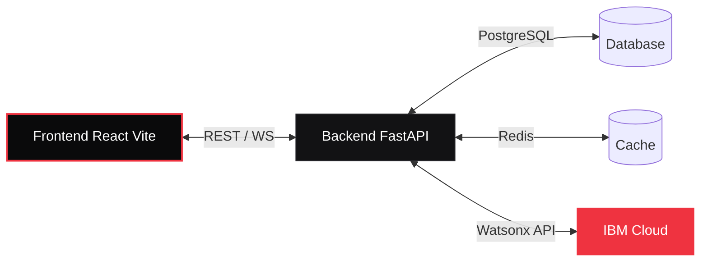

<div align="center">

# 📖 Quick Start Guide
**PitMind Documentation**

[](#)
[](../README.md)

</div>

<br/>

> **Overview:** This document outlines the core concepts, configurations, and technical specifications for the **Quick Start Guide** module within the PitMind AI ecosystem.

---

Get PitMind running locally in 5 minutes.


<details>
<summary><b>Prerequisites</b></summary>
<br/>

- Docker & Docker Compose (recommended) **OR**
- Python 3.12 + Node.js 20
- Watsonx API key from IBM Cloud
- Firebase project credentials

<br/>

### Local Architecture



</details>


<details>
<summary><b>1. Clone & Configure</b></summary>
<br/>

```bash
git clone https://github.com/your-org/pitmind.git
cd pitmind
cp .env.example .env
```

</details>


<details>
<summary><b>2. Fill in `.env`</b></summary>
<br/>

Get credentials from:
- **Watsonx**: IBM Cloud Console → watsonx.ai → Create project → Copy API key, project ID, URL
- **Firebase**: Firebase Console → Project settings → Web app credentials
- **Google Maps** (optional): Google Cloud Console → Enable Maps JavaScript API

Minimal `.env` for testing:
```env
WATSONX_API_KEY=your_api_key
WATSONX_PROJECT_ID=your_project_id
WATSONX_URL=https://us-south.ml.cloud.ibm.com

VITE_FIREBASE_API_KEY=your_firebase_key
VITE_FIREBASE_DATABASE_URL=https://your-project.firebaseio.com
```

</details>


<details>
<summary><b>3a. Run with Docker (Recommended)</b></summary>
<br/>

```bash
docker compose up --build
```

Wait for both services to start:
```
pitmind-web-1  | Ready in 0ms
pitmind-api-1  | Uvicorn running on http://0.0.0.0:8000
```

Open **http://localhost:8080** in your browser.

</details>


<details>
<summary><b>3b. Run Locally (Python + Node)</b></summary>
<br/>

Backend:
```bash
cd backend
python -m venv .venv
source .venv/bin/activate  # or .venv\Scripts\activate on Windows
pip install -r requirements.txt
uvicorn main:app --reload --port 8000
```

Frontend (new terminal):
```bash
cd frontend
npm install
npm run dev -- --host 127.0.0.1 --port 5173
```

Open **http://localhost:5173** in your browser.

</details>


<details>
<summary><b>First Steps</b></summary>
<br/>

1. **Check API Health** (Backend only):
   ```bash
   curl http://localhost:8001/health
   ```

2. **Browse API Docs**:
   - Docker: http://localhost:8001/docs
   - Local: http://localhost:8000/docs

3. **Stream Real Telemetry** (WebSocket):
   - Open browser DevTools → Network tab
   - Refresh dashboard, watch for `/api/v1/stream/telemetry` WebSocket connection
   - Check StreamHealthMonitor component for latency & connection status

4. **View Health Metrics**:
   - Dashboard → Health Console widget shows 8 system metrics

</details>


<details>
<summary><b>File Structure</b></summary>
<br/>

**Key Files:**
- `backend/main.py` — FastAPI app, endpoints, WebSocket setup
- `frontend/src/pages/Dashboard.tsx` — Main UI, lazy-loaded components
- `frontend/src/hooks/useStreamConnection.ts` — WebSocket client hook
- `frontend/src/contexts/StreamContext.tsx` — Global WebSocket state
- `docs/API.md` — Full endpoint documentation
- `docs/DEPLOYMENT.md` — Production deployment guide

**Component Map:**
- `HealthConsole.tsx` — System health monitoring (Phase 3)
- `BranchingSimulator.tsx` — Pit scenario planning (Phase 2)
- `EventTimeline.tsx` — Race control events (Phase 1)
- `ConfidenceDecompositionCard.tsx` — AI confidence breakdown (Phase 1)

</details>


<details>
<summary><b>Common Tasks</b></summary>
<br/>

### Watch Frontend Rebuild
```bash
cd frontend
npm run dev
```

### Test Backend Changes
```bash
cd backend
pytest tests/
```

### Build for Production
```bash
docker compose build
docker compose up  # Serves optimized build
```

### View Backend Logs
```bash
docker compose logs -f api
```

### Reset Database/Cache
```bash
docker compose down -v  # Remove volumes
docker compose up --build
```

</details>


<details>
<summary><b>Troubleshooting</b></summary>
<br/>

**Can't connect to WebSocket?**
- Backend not running: Check `curl http://localhost:8001/health` returns 200
- Wrong origin: Verify `BACKEND_CORS_ORIGINS` in `.env` includes your frontend URL
- Firewall: Ensure port 8001 is not blocked

**API returns 503 "Service Unavailable"?**
- Watsonx credentials invalid: Check `WATSONX_API_KEY` and `WATSONX_PROJECT_ID` in `.env`
- Network issue: Verify connectivity to `https://us-south.ml.cloud.ibm.com`

**Frontend shows "Disconnected" in StreamHealthMonitor?**
- Check browser console for WebSocket errors
- Verify backend `/health` endpoint returns 200
- Restart both services: `docker compose down && docker compose up`

**Build fails with TypeScript errors?**
- Clear cache: `cd frontend && rm -rf dist node_modules && npm install && npm run build`
- Check Node version: `node --version` (should be 20+)

</details>


<details>
<summary><b>Next Steps</b></summary>
<br/>

1. **Explore the Code**
   - Start in `frontend/src/pages/Dashboard.tsx`
   - Trace to lazy-loaded components
   - Look at `StreamContext` for WebSocket pattern

2. **Read Architecture Docs**
   - [docs/architecture.md](../docs/architecture.md) — System design
   - [docs/API.md](../docs/API.md) — Endpoint spec
   - [docs/DEPLOYMENT.md](../docs/DEPLOYMENT.md) — Production setup

3. **Run Tests**
   ```bash
   cd backend && pytest
   cd frontend && npm run test
   ```

4. **Build & Deploy**
   - Single machine: `docker compose up -d`
   - Kubernetes: See [docs/DEPLOYMENT.md](../docs/DEPLOYMENT.md)
   - CI/CD: GitHub Actions, GitLab CI, or Jenkins

</details>


<details>
<summary><b>Support</b></summary>
<br/>

- **Watsonx issues**: Check IBM Cloud documentation
- **Firebase issues**: Check Firebase Console → Realtime Database → Rules
- **Code questions**: Review inline comments in source files
- **Architecture questions**: See [docs/architecture.md](../docs/architecture.md)

</details>

---

<div align="center">
  <p>Built for the speed of Formula 1. Engineered for absolute transparency.</p>
  <p><a href="../README.md">🏠 Back to Main README</a></p>
</div>
