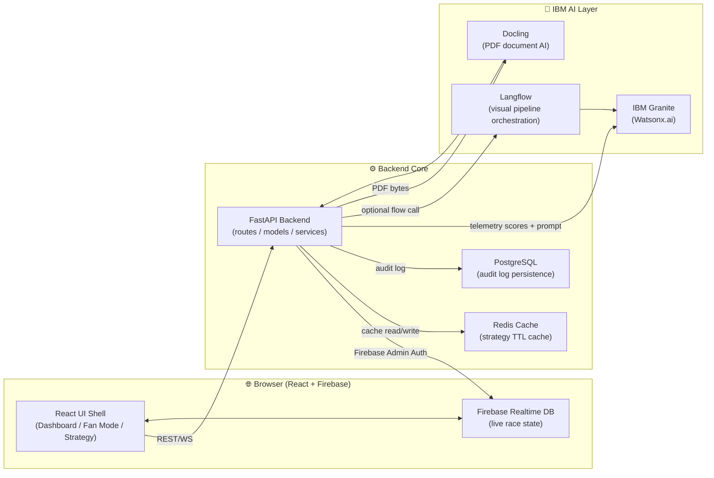
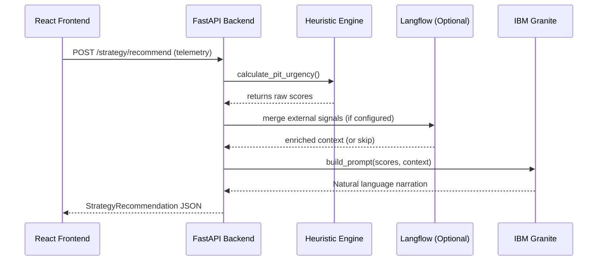
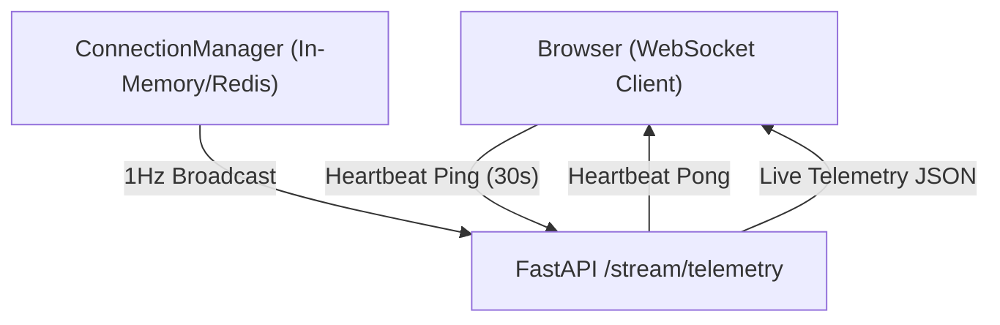

<div align="center">

# 🏗️ PitMind System Architecture
**Deep Dive into the Technical Design**

[](#)
[](../README.md)

</div>

<br/>

> [!NOTE]
> PitMind is a full-stack AI race strategy platform built for Formula 1-style environments. This document describes every layer of the system, data flows, and how the IBM AI integrations connect.

---

<details open>
<summary><b>High-Level Architecture Diagram</b></summary>
<br/>


</details>

---

## 🧩 Component Breakdown

<details>
<summary><b>Frontend Directory (<code>frontend/</code>)</b></summary>
<br/>

The frontend is a Vite + React application utilizing a glassmorphic design system to mimic an F1 pit-wall telemetry screen.

| Component | Purpose |
|---|---|
| `pages/Dashboard.tsx` | Engineer console — 3-column resizable/draggable layout |
| `pages/FanMode.tsx` | Public fan view — battle cards, standings, AI narratives |
| `components/dashboard/ConfidenceDecompositionCard.tsx` | Explainability — breaks AI confidence into 4 dimensions |
| `components/dashboard/StreamHealthMonitor.tsx` | WebSocket health + latency |
| `hooks/useFirebaseRaceState.ts` | Firebase Realtime DB subscription for live race state |
| `contexts/RoleContext.tsx` | Engineer / Strategist / Commentator role switching |
</details>

<details>
<summary><b>Backend Directory (<code>backend/</code>)</b></summary>
<br/>

The backend is a high-performance Python FastAPI server built for concurrency and streaming.

| Module | Purpose |
|---|---|
| `main.py` | FastAPI app — CORS, middleware, WebSocket streaming, health |
| `routes/strategy.py` | Strategy scoring endpoints and Granite narration requests |
| `routes/commentary.py` | Granite chat + Docling PDF debrief upload |
| `services/granite.py` | IBM Granite client with intelligent caching |
| `services/strategy_engine.py` | Mathematical heuristic pit urgency / compound scoring |
| `services/sanitize.py` | Upload validation, CSV/JSON parsing, byte-cap enforcement |
| `services/cache_manager.py` | Redis + in-memory fallback caching with TTL |
</details>

---

## 🧠 IBM AI Pipeline Data Flow

<details open>
<summary><b>Strategy Recommendation Flow</b></summary>
<br/>



> [!IMPORTANT]
> The raw heuristic scores are calculated *before* being sent to IBM Granite. Granite is explicitly instructed to explain the mathematical recommendation, rather than guessing the math itself, ensuring absolute accuracy.

</details>

<details>
<summary><b>Post-Race Debrief (Docling) Flow</b></summary>
<br/>

1. User uploads PDF to `/api/v1/debrief/upload`
2. `_try_docling_pdf(raw)` called:
   - Uses IBM's `DocumentConverter` for Docling layout analysis
   - Exports high-fidelity Markdown, preserving tables and structure
3. `debrief_from_text(markdown_text)` called:
   - Granite assumes the role of "Senior Chief Race Strategist"
   - Generates 5-section technical debrief
4. Response returned with `source_note` showing Docling provenance (page counts, table counts).
</details>

<details>
<summary><b>Langflow Pipeline Orchestration</b></summary>
<br/>

Langflow is integrated as an **optional visual pipeline orchestration layer** in the strategy pipeline. When configured, it runs as Step 2b between heuristic scoring and Granite narration.

**Integration Points:**
- **Entry point:** `services/langflow_client.py` → `run_strategy_flow(payload)`
- **Called by:** `services/pipeline.py` → `run_strategy_pipeline()` — Step 2b in the pipeline
- **API endpoint:** `POST /api/v1/run/{flow_id}` on the configured Langflow instance
- **Payload sent:** Circuit name, driver, lap count, last lap telemetry snapshot
- **Failure mode:** Graceful degradation — if Langflow is unconfigured or unavailable, the pipeline skips this step and continues to Granite narration

**Configuration (`.env`):**
```
LANGFLOW_API_URL=https://your-langflow-instance.com
LANGFLOW_FLOW_ID=your-flow-uuid
LANGFLOW_API_KEY=your-api-key
```

> [!TIP]
> Langflow enables non-technical team members to visually design and modify AI pipeline workflows (e.g., adding weather data enrichment, competitor feed integration) without touching backend code.

</details>

<details>
<summary><b>Confidence Decomposition</b></summary>
<br/>

Every strategy recommendation includes a **Confidence Decomposition** — breaking AI confidence into 4 transparent, auditable dimensions:

| Dimension | What It Measures | How It's Computed |
|---|---|---|
| **Data Quality** | Completeness of telemetry input | Ratio of valid lap times to total laps, scaled 20–100% |
| **Model Certainty** | Granite's confidence in its narration | Extracted from LLM response's `confidence` field |
| **Stability** | Score consistency across similar inputs | Based on pit urgency threshold bands (≥62 = stable) |
| **Regret Bound** | Maximum expected decision regret | `(100 - confidence) / 100`, bounded 0–1 |

This decomposition ensures race engineers never have to blindly trust a single confidence number — they can inspect *which dimension* is weak and adjust their decision accordingly.

</details>

---

## 📡 Live Telemetry Infrastructure

<details>
<summary><b>WebSocket Streaming Architecture</b></summary>
<br/>



> [!TIP]
> The `StreamHealthMonitor` in the React frontend tracks packet latency and connection stability. If a disconnect occurs, the client automatically initiates an exponential backoff retry up to 10 times.
</details>

---

<div align="center">
  <p>Built for the speed of Formula 1. Engineered for absolute transparency.</p>
  <p><a href="../README.md">🏠 Back to Main README</a></p>
</div>
